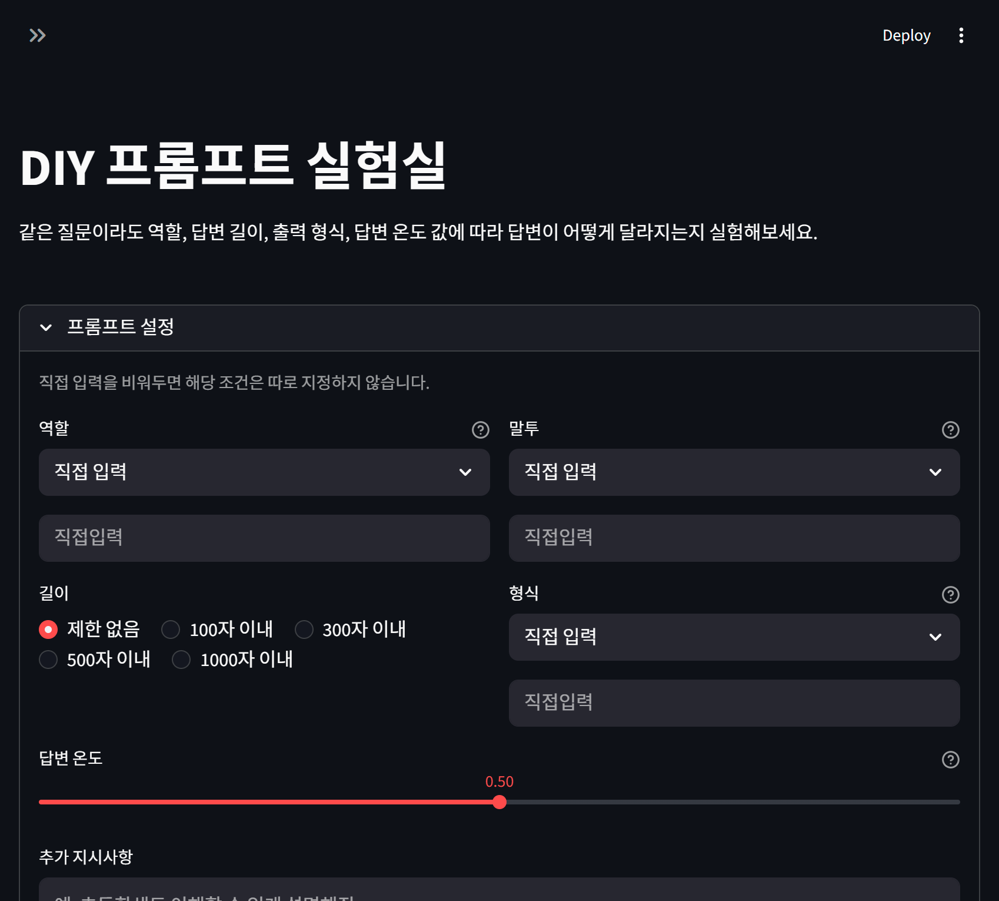
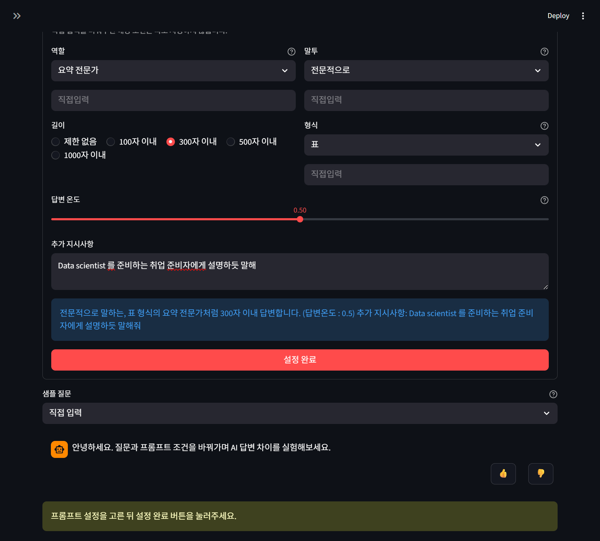
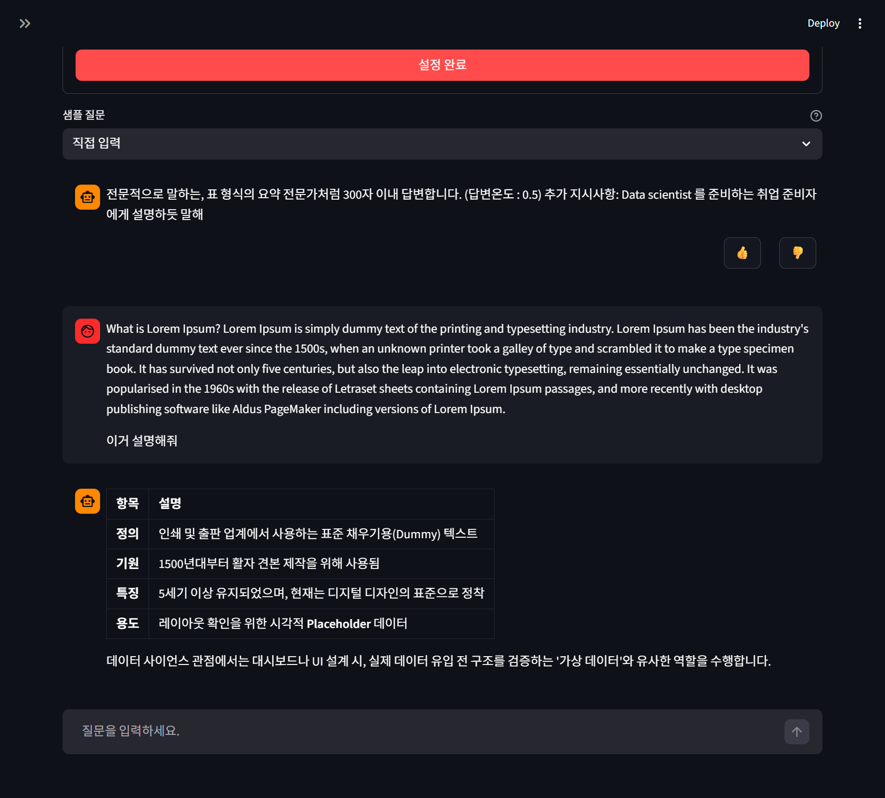

# DIY 프롬프트 실험실

같은 질문이라도 역할, 말투, 답변 길이, 출력 형식, 답변 온도에 따라 AI 답변이 어떻게 달라지는지 실험해보는 Streamlit 앱입니다.

## 주요 기능

- 역할, 말투, 답변 길이, 출력 형식 설정
- 답변 온도 조절
- 추가 지시사항 입력
- 현재 적용된 프롬프트 확인
- 샘플 질문 선택 및 직접 질문 입력
- AI 답변 피드백 기록

## 화면

### 프롬프트 설정

### 답변 결과

## 주요 파일

- `app.py`: Streamlit 앱
- `ai_chatbot.py`: Gemini API 응답 처리
- `requirements.txt`: 필요한 패키지 목록
- `.env.example`: 환경 변수 예시
